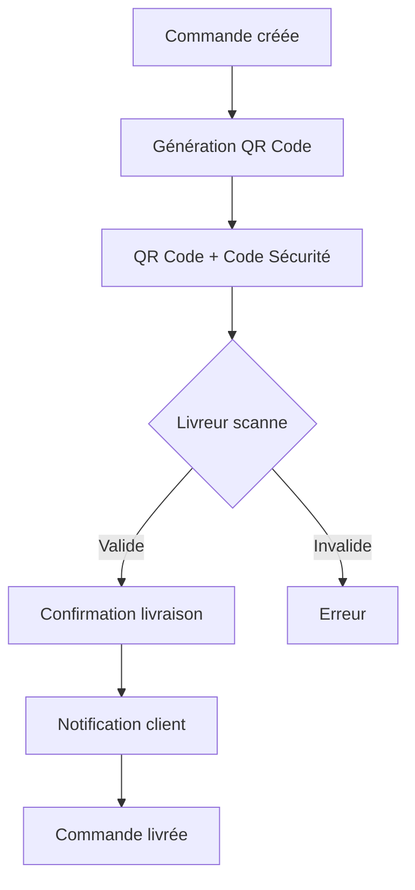

# 📋 Plan d'Implémentation SISMA - Par Priorité Technique

## Vue d'Ensemble du Projet

**SISMA** est une plateforme e-commerce multi-vendeurs développée avec:
- **Backend**: Laravel 10 (API REST)
- **Frontend Client**: React + TypeScript + Vite + shadcn/ui
- **Frontend Admin**: React + TypeScript + Vite + shadcn/ui
- **Frontend Fournisseur**: React + TypeScript + Vite
- **Base de données**: MySQL

---

## Ordre de Priorité Technique

### 1️⃣ PRIORITÉ 1: Backend/API

#### Objectif
Développer les endpoints API manquants et implémenter les services backend essentiels.

#### Étapes d'Implémentation

```
┌─────────────────────────────────────────────────────────────────────────┐
│ 1.1 ENDPOINTS API MANQUANTS                                           │
├─────────────────────────────────────────────────────────────────────────┤
│ - GET    /api/v1/supplier/wallet              (Solde portefeuille)   │
│ - GET    /api/v1/supplier/transactions         (Historique transact.) │
│ - POST   /api/v1/supplier/withdraw             (Demande retrait)      │
│ - GET    /api/v1/admin/commissions            (Gestion commissions)  │
│ - POST   /api/v1/admin/commissions/calculate  (Calcul commission)     │
│ - GET    /api/v1/driver/wallet                (Solde livreur)       │
│ - POST   /api/v1/client/orders/{id}/cancel    (Annulation commande)  │
│ - GET    /api/v1/client/addresses             (Adresses client)      │
│ - POST   /api/v1/client/addresses             (Ajouter adresse)      │
└─────────────────────────────────────────────────────────────────────────┘

┌─────────────────────────────────────────────────────────────────────────┐
│ 1.2 SERVICES BACKEND À IMPLÉMENTER                                    │
├─────────────────────────────────────────────────────────────────────────┤
│ ✓ QrCodeService         → Génération/validation QR code               │
│ ✓ CommissionService     → Calcul des commissions (10-20%)             │
│ ✓ InvoiceService        → Génération factures PDF                     │
│ ✓ DeliveryGroupingService → Regroupement livraisons                   │
│ ✓ SupplierWalletService → Gestion portefeuille fournisseur            │
│ ✓ RiskManagementService → Détection comportements à risque           │
│ ✓ SubscriptionBillingService → Gestion abonnements                   │
│ ✓ CampaignClickValidatorService → Validation clics pub                │
└─────────────────────────────────────────────────────────────────────────┘

┌─────────────────────────────────────────────────────────────────────────┐
│ 1.3 FICHIERS BACKEND À CRÉER/MODIFIER                                │
├─────────────────────────────────────────────────────────────────────────┤
│ app/Http/Controllers/Api/V1/SupplierWalletController.php   (NOUVEAU)  │
│ app/Http/Controllers/Api/V1/AdminCommissionController.php  (NOUVEAU)   │
│ app/Http/Controllers/Api/V1/ClientAddressController.php    (NOUVEAU)   │
│ app/Services/CommissionService.php                   (NOUVEAU)       │
│ app/Services/SupplierWalletService.php                (NOUVEAU)       │
│ app/Models/Wallet.php                                 (NOUVEAU)       │
│ app/Models/Transaction.php                            (NOUVEAU)       │
│ routes/api.php                                       (MODIFIER)       │
│ database/migrations/                                 (CRÉER)          │
└─────────────────────────────────────────────────────────────────────────┘
```

#### Livrables
- [ ] 10+ nouveaux endpoints API fonctionnels
- [ ] 2+ services backend actifs
- [ ] Tests API pour chaque endpoint

---

### 2️⃣ PRIORITÉ 2: Corrections Admin

#### Objectif
Développer les pages admin manquantes et améliorer l'expérience administrateur.

#### Étapes d'Implémentation

```
┌─────────────────────────────────────────────────────────────────────────┐
│ 2.1 PAGES ADMIN À DÉVELOPPER                                          │
├─────────────────────────────────────────────────────────────────────────┤
│ ✓ Dashboard Super Admin          → Stats globales multi-plateforme    │
│ ✓ Gestion Livreurs CRUD           → Créer/modifier/suspendre          │
│ ✓ Gestion Retours                 → Processus retour produits          │
│ ✓ Rapports Analytics             → Graphiques et export               │
│ ✓ Paramètres Avancés              → Configuration système             │
│ ✓ Gestion Catégories              → CRUD catégories + champsdyn.       │
│ ✓ Gestion_slider Promotions       → Page d'accueil                    │
└─────────────────────────────────────────────────────────────────────────┘

┌─────────────────────────────────────────────────────────────────────────┐
│ 2.2 SERVICES API ADMIN                                                 │
├─────────────────────────────────────────────────────────────────────────┤
│ - Hooks React Query pour chaque endpoint                              │
│ - Services de gestion (products.service.ts, orders.service.ts)         │
│ - Context d'authentification admin                                     │
│ - Intercepteurs pour gestion tokens                                    │
└─────────────────────────────────────────────────────────────────────────┘

┌─────────────────────────────────────────────────────────────────────────┐
│ 2.3 COMPOSANTS ADMIN                                                   │
├─────────────────────────────────────────────────────────────────────────┤
│ - DataTable réutilisable avec tri/filtrage/pagination                 │
│ - StatCard avec graphiques                                            │
│ - Timeline de suivi commandes                                          │
│ - Système de notifications                                             │
│ - Export PDF/Excel                                                     │
└─────────────────────────────────────────────────────────────────────────┘
```

#### Livrables
- [ ] 5+ pages admin fonctionnelles
- [ ] Services API connectés
- [ ] Composants réutilisables

---

### 3️⃣ PRIORITÉ 3: Affichage Commandes + QR Code

#### Objectif
Implémenter le système complet de gestion des commandes avec QR code.

#### Étapes d'Implémentation

```
┌─────────────────────────────────────────────────────────────────────────┐
│ 3.1 AFFICHAGE QR CODE CLIENT                                          │
├─────────────────────────────────────────────────────────────────────────┤
│ ✓ Page OrderDetail client avec QR code                                │
│   - Affichage QR code de livraison                                    │
│   - Code de sécurité unique                                           │
│   - Instructions de livraison                                         │
│   - Suivi du statut en temps réel                                     │
│                                                                         │
│ ✓ Notifications push lors changements statut                          │
│ ✓ Téléchargement QR code en image                                     │
└─────────────────────────────────────────────────────────────────────────┘

┌─────────────────────────────────────────────────────────────────────────┐
│ 3.2 SCAN QR CODE LIVREUR                                               │
├─────────────────────────────────────────────────────────────────────────┤
│ ✓ Page DriverScanQr                                                   │
│   - Caméra pour scan QR code                                          │
│   - Validation automatique                                            │
│   - Saisie manuelle code sécurité                                     │
│   - Confirmation livraison                                            │
│                                                                         │
│ ✓ API: POST /api/v1/driver/orders/{id}/scan                          │
│ ✓ API: POST /api/v1/driver/orders/{id}/confirm-delivery             │
└─────────────────────────────────────────────────────────────────────────┘

┌─────────────────────────────────────────────────────────────────────────┐
│ 3.3 SYSTÈME DE VALIDATION LIVRAISON                                   │
├─────────────────────────────────────────────────────────────────────────┤
│ ✓ Validation QR code avec code sécurité                               │
│ ✓ Enregistrement: timestamp, méthode, utilisateur                     │
│ ✓ Notification client livraison confirmée                            │
│ ✓ Historique des scans dans order-detail admin                        │
└─────────────────────────────────────────────────────────────────────────┘
```

#### Mermaid - Flux QR Code


#### Livrables
- [ ] Page QR code client fonctionnelle
- [ ] Scan QR code livreur opérationnel
- [ ] Système de validation complet

---

### 4️⃣ PRIORITÉ 4: Logique Fournisseur

#### Objectif
Développer le frontend fournisseur complet avec toutes les fonctionnalités.

#### Étapes d'Implémentation

```
┌─────────────────────────────────────────────────────────────────────────┐
│ 4.1 DASHBOARD FOURNISSEUR                                              │
├─────────────────────────────────────────────────────────────────────────┤
│ ✓ Métriques clés                                                       │
│   - Ventes du jour/mois/année                                         │
│   - Commandes en attente                                              │
│   - Produits actifs                                                    │
│   - Note moyenne                                                       │
│   - Revenus portefeuille                                              │
│                                                                         │
│ ✓ Graphiques évolution ventes                                          │
│ ✓ Notifications commandes                                              │
└─────────────────────────────────────────────────────────────────────────┘

┌─────────────────────────────────────────────────────────────────────────┐
│ 4.2 GESTION PRODUITS FOURNISSEUR                                       │
├─────────────────────────────────────────────────────────────────────────┤
│ ✓ Liste produits avec filtres                                         │
│ ✓ Création produit avec formulaire dynamique                          │
│   - Nom, description, prix, stock                                      │
│   - Images multiples                                                   │
│   - Catégorie avec champs spécifiques                                 │
│   - Variants (taille, couleur)                                        │
│ ✓ Modification/duplication produits                                    │
│ ✓ Import/export CSV                                                   │
└─────────────────────────────────────────────────────────────────────────┘

┌─────────────────────────────────────────────────────────────────────────┐
│ 4.3 SYSTÈME DE COMMANDES                                               │
├─────────────────────────────────────────────────────────────────────────┤
│ ✓ Liste commandes avec statuts                                        │
│ ✓ Détail commande avec items                                          │
│ ✓ Mise à jour statut                                                  │
│   - pending → confirmed → preparing → shipped                         │
│ ✓ Communication client (WhatsApp)                                     │
│ ✓ Historique statuts                                                  │
└─────────────────────────────────────────────────────────────────────────┘

┌─────────────────────────────────────────────────────────────────────────┐
│ 4.4 WALLET & REVENUS                                                   │
├─────────────────────────────────────────────────────────────────────────┤
│ ✓ Solde actuel                                                        │
│ ✓ Historique transactions                                             │
│   - Ventes                                                            │
│   - Retraits                                                          │
│   - Commissions                                                       │
│ ✓ Demande retrait                                                     │
│ ✓ Calcul commission (10-20%)                                         │
└─────────────────────────────────────────────────────────────────────────┘

┌─────────────────────────────────────────────────────────────────────────┐
│ 4.5 CAMPAGNES MARKETING                                                │
├─────────────────────────────────────────────────────────────────────────┤
│ ✓ Création campagne CPC                                               │
│   - Budget quotidien                                                  │
│   - Prix par clic                                                     │
│   - Produits ciblés                                                   │
│ ✓ Statistiques campagne                                               │
│ ✓ Gestion 广告 credits                                                │
└─────────────────────────────────────────────────────────────────────────┘
```

#### Livrables
- [ ] Dashboard fournisseur complet
- [ ] CRUD produits avec variants
- [ ] Gestion commandes complète
- [ ] Wallet fonctionnel
- [ ] Campagnes marketing

---

### 5️⃣ PRIORITÉ 5: Formulaire Dynamique

#### Objectif
Implémenter le système de formulaire dynamique basé sur les catégories.

#### Étapes d'Implémentation

```
┌─────────────────────────────────────────────────────────────────────────┐
│ 5.1 FORMULAIRE CATÉGORIEL                                             │
├─────────────────────────────────────────────────────────────────────────┤
│ ✓ Composant DynamicForm générique                                     │
│   - Types de champs: text, number, select, multiselect, textarea,     │
│                      date, boolean, file                               │
│   - Validation par champ                                              │
│   - Affichage conditionnel                                            │
│   - Sauvegarde automatique                                            │
│                                                                         │
│ ✓ Catégorie: Vêtements                                                │
│   - Taille [S, M, L, XL, XXL]                                       │
│   - Couleur [collection de couleurs]                                  │
│   - Matière [coton, polyester, etc.]                                  │
│                                                                         │
│ ✓ Catégorie: Électronique                                            │
│   - Marque                                                            │
│   - Modèle                                                            │
│   - Garantie                                                          │
│                                                                         │
│ ✓ Catégorie: Alimentation                                            │
│   - Date expiration                                                   │
│   - Marque                                                            │
│   - Pays origine                                                      │
└─────────────────────────────────────────────────────────────────────────┘

┌─────────────────────────────────────────────────────────────────────────┐
│ 5.2 API SCHÉMAS CATÉGORIE                                             │
├─────────────────────────────────────────────────────────────────────────┤
│ ✓ GET /api/categories/{id}/schema                                    │
│   - Retourne les champs dynamiques                                     │
│   - Types, validations, options                                       │
│                                                                         │
│ ✓ POST /api/admin/categories/{id}/fields                             │
│   - Créer champ dynamique                                             │
│                                                                         │
│ ✓ GET /api/v1/supplier/products/validate                              │
│   - Validation produit dynamique                                      │
└─────────────────────────────────────────────────────────────────────────┘

┌─────────────────────────────────────────────────────────────────────────┐
│ 5.3 VALIDATION DYNAMIQUE                                               │
├─────────────────────────────────────────────────────────────────────────┤
│ ✓ Service DynamicProductValidator                                    │
│   - Validation basée catégorie                                       │
│   - Messages d'erreur personnalisés                                   │
│   - Sanitization données                                             │
│                                                                         │
│ ✓ Backend: ProductController                                         │
│   - Store + Update avec validation dynamique                         │
└─────────────────────────────────────────────────────────────────────────┘
```

#### Livrables
- [ ] DynamicForm complet
- [ ] 3+ catégories avec champs spécifiques
- [ ] API schémas fonctionnelle
- [ ] Validation backend

---

### 6️⃣ PRIORITÉ 6: UI/UX Design

#### Objectif
Développer un design system complet et améliorer l'expérience utilisateur.

#### Étapes d'Implémentation

```
┌─────────────────────────────────────────────────────────────────────────┐
│ 6.1 DESIGN SYSTEM SISMA                                               │
├─────────────────────────────────────────────────────────────────────────┤
│ ✓ Couleurs marque                                                     │
│   - Primaire: #D81918 (Rouge)                                        │
│   - Secondaire: #F7941D (Orange)                                      │
│   - Gradients: linear-gradient(135deg, #D81918, #F7941D)            │
│                                                                         │
│ ✓ Typographie                                                         │
│   - Display: Outfit (titres)                                          │
│   - Body: DM Sans (texte)                                             │
│                                                                         │
│ ✓ Espacement (Tailwind)                                               │
│   - sm: 4px, md: 8px, lg: 16px, xl: 24px, 2xl: 32px                  │
│                                                                         │
│ ✓ Border radius                                                       │
│   - sm: 4px, md: 8px, lg: 12px, xl: 16px                             │
└─────────────────────────────────────────────────────────────────────────┘

┌─────────────────────────────────────────────────────────────────────────┐
│ 6.2 COMPOSANTS UI RÉUTILISABLES                                        │
├─────────────────────────────────────────────────────────────────────────┤
│ ✓ ProductCard (client + admin)                                       │
│   - Image avec lazy loading                                          │
│   - Badge réduction                                                   │
│   - Boutons actions                                                   │
│   - Animations hover                                                  │
│                                                                         │
│ ✓ Button (plusieurs variants)                                        │
│   - Primary, secondary, outline, ghost                               │
│   - Tailles: sm, md, lg                                               │
│   - États: default, hover, active, disabled                          │
│                                                                         │
│ ✓ Input, Select, Textarea                                            │
│ ✓ Modal, Dialog, Drawer                                               │
│ ✓ Toast, Notification                                                 │
│ ✓ Table avec pagination                                               │
│ ✓ Tabs, Accordion                                                     │
└─────────────────────────────────────────────────────────────────────────┘

┌─────────────────────────────────────────────────────────────────────────┐
│ 6.3 RESPONSIVE DESIGN                                                  │
├─────────────────────────────────────────────────────────────────────────┤
│ ✓ Breakpoints                                                         │
│   - Mobile: < 640px (1 colonne)                                      │
│   - Tablet: 640px - 1024px (2 colonnes)                              │
│   - Desktop: > 1024px (3-4 colonnes)                                 │
│                                                                         │
│ ✓ Navigation mobile                                                   │
│   - Hamburger menu                                                    │
│   - Bottom navigation                                                 │
│                                                                         │
│ ✓ Images responsives                                                  │
│   - srcset pour différents écrans                                     │
│   - Lazy loading                                                       │
└─────────────────────────────────────────────────────────────────────────┘

┌─────────────────────────────────────────────────────────────────────────┐
│ 6.4 ANIMATIONS & MICRO-INTERACTIONS                                   │
├─────────────────────────────────────────────────────────────────────────┤
│ ✓ Animations UI                                                       │
│   - Fade in/out                                                       │
│   - Slide in/out                                                      │
│   - Scale                                                             │
│                                                                         │
│ ✓ Micro-interactions                                                  │
│   - Hover sur boutons                                                 │
│   - Focus sur inputs                                                  │
│   - Loading states                                                    │
│   - Success/error feedback                                           │
│                                                                         │
│ ✓ Transitions page                                                    │
│   - Navigation fluide                                                │
└─────────────────────────────────────────────────────────────────────────┘
```

#### Livrables
- [ ] Design system documenté
- [ ] 10+ composants réutilisables
- [ ] Responsive sur tous écrans
- [ ] Animations fluides

---

### 7️⃣ PRIORITÉ 7: Compte Utilisateur

#### Objectif
Développer le système complet de gestion de compte utilisateur.

#### Étapes d'Implémentation

```
┌─────────────────────────────────────────────────────────────────────────┐
│ 7.1 AUTHENTIFICATION CLIENT                                            │
├─────────────────────────────────────────────────────────────────────────┤
│ ✓ Inscription (Register)                                              │
│   - Nom, email, téléphone, mot de passe                               │
│   - Validation email (token)                                          │
│   - Connexion automatique après validation                           │
│                                                                         │
│ ✓ Connexion (Login)                                                   │
│   - Email + mot de passe                                              │
│   - Remember me                                                       │
│   - Mot de passe oublié                                               │
│                                                                         │
│ ✓ Déconnexion                                                         │
│   - Invalidation token                                                │
│   - Nettoyage localStorage                                            │
└─────────────────────────────────────────────────────────────────────────┘

┌─────────────────────────────────────────────────────────────────────────┐
│ 7.2 PROFIL UTILISATEUR                                                 │
├─────────────────────────────────────────────────────────────────────────┤
│ ✓ Informations profil                                                 │
│   - Nom complet                                                       │
│   - Email                                                             │
│   - Téléphone                                                          │
│   - Photo avatar                                                      │
│                                                                         │
│ ✓ Adresse de livraison                                                │
│   - Commune, quartier, référence                                     │
│   -_multiple adresses                                                 │
│   - Adresse par défaut                                                │
│                                                                         │
│ ✓ Préférences                                                         │
│   - Notifications email                                               │
│   - Notifications SMS                                                 │
│   - Langue                                                            │
└─────────────────────────────────────────────────────────────────────────┘

┌─────────────────────────────────────────────────────────────────────────┐
│ 7.3 GESTION SESSIONS                                                   │
├─────────────────────────────────────────────────────────────────────────┤
│ ✓ Stockage token                                                       │
│   - localStorage + sessionStorage                                     │
│   - Refresh token automatique                                        │
│                                                                         │
│ ✓ Gestion sessions                                                    │
│   - Détection expiration                                             │
│   - Redirect connexion                                                │
│   - Persistance état                                                  │
│                                                                         │
│ ✓ Sécurité                                                            │
│   - XSS protection                                                    │
│   - CSRF token                                                        │
└─────────────────────────────────────────────────────────────────────────┘

┌─────────────────────────────────────────────────────────────────────────┐
│ 7.4 NOTIFICATIONS UTILISATEUR                                          │
├─────────────────────────────────────────────────────────────────────────┤
│ ✓ Types notifications                                                  │
│   - Commande créée                                                    │
│   - Statut modifié                                                    │
│   - Livraison confirmée                                               │
│   - Message fournisseur                                               │
│                                                                         │
│ ✓ Canaux                                                              │
│   - In-app (toast)                                                    │
│   - Email (via backend)                                               │
│                                                                         │
│ ✓ Préférences notifications                                          │
│   - Par type                                                          │
│   - Activé/désactivé                                                  │
└─────────────────────────────────────────────────────────────────────────┘
```

#### Livrables
- [ ] Authentification complète
- [ ] Profil utilisateur
- [ ] Gestion sessions
- [ ] Notifications

---

## 📊 Résumé des Livrables par Priorité

| Priorité | Catégorie | Livrables |
|----------|-----------|-----------|
| 1 | Backend/API | 10+ endpoints, 2+ services |
| 2 | Admin | 5+ pages, services API |
| 3 | QR Code | Client + Livreur + Validation |
| 4 | Fournisseur | Dashboard + Produits + Commandes + Wallet |
| 5 | Formulaire Dynamique | Composant + Catégories + Validation |
| 6 | UI/UX | Design System + 10+ Composants + Responsive |
| 7 | Compte Utilisateur | Auth + Profil + Sessions + Notifications |

---

## 🚀 Prochaines Étapes

1. **Valider ce plan** avec les parties prenantes
2. **Commencer par Priorité 1** (Backend/API) - Fondations
3. **Itérer** sur les priorités suivantes
4. **Tester** chaque fonctionnalité avant de passer à la suite
5. **Documenter** les décisions techniques

---

*Document généré le 19 Mars 2026*
*Projet: SISMA E-commerce*
